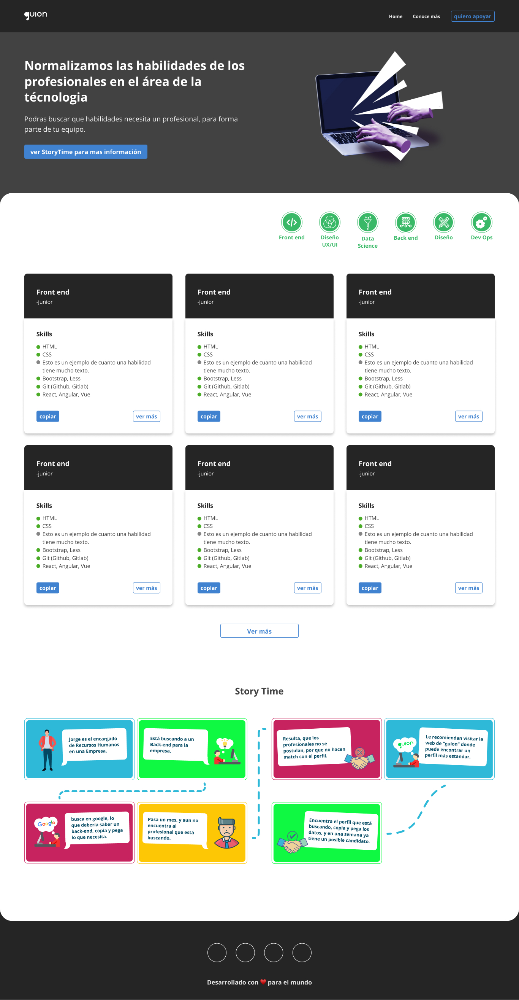

# Proyecto guion

El objetivo principal de esta página es darle solución a un problema muy común, con las propuestas de trabajo que vemos diariamente, y es que “la gran gran  mayoría de las propuestas de trabajo buscan personas que no concuerdan con el perfil que ellos necesitan”.

Por ejemplo,  Nos podemos encontrar que en una propuesta de trabajo ocurra lo siguiente

* SE BUSCA persona con conocimientos en Diseño gráfico, google Ads  y PHP.
* $100 / mes

Lo cual es, completamente erróneo y fuera de contexto, pero lamentablemente ocurre.

## ¿Cómo le daremos Solución?

1. Para solucionarlo, se espera el apoyo de la gran comunidad dentro de Github. con su ayuda podremos definir qué conocimientos necesitan ciertos perfiles, el salario aproximado, etc.
2. Hacer que las empresas conozcan este sitio.
Aún no se definió este punto, pero hay opciones, como envío de email, otra que cada postulante a un trabajo menciona la página, etc.

## ¿Cómo apoyar?

**si quieres dar tu apoyo solo basta con solicitarlo en uno de los issues del proyecto.**

### Capturas del proyecto

Desktop version

Mobile version

